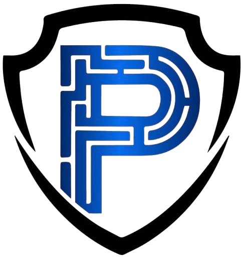

<div align="center">



</div>

### Available Tools

- [AURA](AURA/README.md)
- [Traceix](TRACEIX/README.md)
- [Yara Rule Playground](YARA/README.md)
- [Ransom Note Comparison](RANSOM/README.md)

### Expected API Response Output

##### API BASE URL: `https://ai.perkinsfund.org`

```json
{
  "copyright": "(c) PCEF all rights reserved", (only shown if no API key is passed)
  "error": {
    "error_message": ... (if an error)
  },
  "request_timestamp": 1743098585.390719,
  "results": {
    ... || null
  },
  "sponsor": { (if invalid or no API key provided in request)
    "link": ...,
    "title": ...
  },
  "success": true || false (if an error)
}
```

##### Field descriptions

- `error` – Contains error messages if any occurred. Will be empty dictionary on success.
- `request_timestamp` – UNIX timestamp when the request was received.
- `results` – Contains the results from the received request.
- `sponsor` – A message and link to the sponsor (only shown to users without an API key).
- `success` – A boolean indicating if the request was successfully processed.

